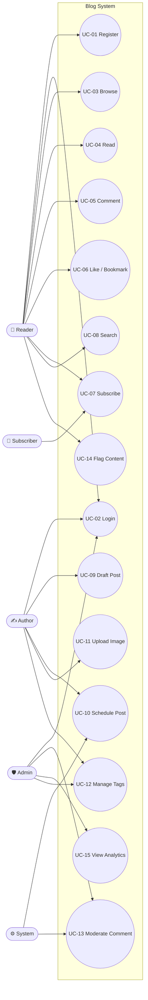

# 02 — Use Cases

This document lists the actors of the Cozy Lagoon blog and catalogues the 15 use cases that drive the product. Each UC traces back to one or more functional requirements in [01](01-requirements.md).

## Actors

| Actor          | Description                                                                                                                            |
| -------------- | -------------------------------------------------------------------------------------------------------------------------------------- |
| **Reader**     | Unauthenticated visitor, or a logged-in user with the `reader` role. Consumes content.                                                 |
| **Author**     | Logged-in user with the `author` role. Creates and maintains their own posts.                                                          |
| **Admin**      | Logged-in user with the `admin` role. Oversees content, users, moderation, and newsletter.                                             |
| **Subscriber** | An email address (not necessarily a registered user) that has confirmed newsletter signup.                                             |
| **System**     | The Laravel scheduler + queue worker. Runs jobs (scheduled publish, mail, image variants, Scout re-index) without a human in the loop. |

## Use case diagram

## Use case catalog

Every UC below follows the template: **ID · Name · Primary Actor · Preconditions · Main Flow · Alt Flows · Postcondition · Traces**.

### UC-01 Register

- **Primary actor:** Reader.
- **Preconditions:** Visitor has a valid email, has not already registered.
- **Main flow:**
    1. Visitor opens `/register`.
    2. Fills in name, email, password (min 8).
    3. Submits; system hashes password, creates user with `reader` role.
    4. System sends verification email (queued).
    5. Visitor clicks the verification link.
- **Alt flows:** Email already taken → inline error; expired verification link → request new one.
- **Postcondition:** A verified user exists; session is authenticated.
- **Traces:** FR-001, FR-004.

### UC-02 Login

- **Primary actor:** Reader / Author / Admin.
- **Preconditions:** User is registered and verified.
- **Main flow:** User submits email + password → session authenticated → redirect to intended URL or `/`.
- **Alt flows:** Wrong credentials → generic error; 5 failed attempts → throttled.
- **Postcondition:** Session authenticated.
- **Traces:** FR-002.

### UC-03 Browse posts

- **Primary actor:** Reader.
- **Preconditions:** None.
- **Main flow:** Visits `/` → paginated grid of 6 published posts → clicks pagination.
- **Alt flows:** Filters by tag (`/tags/{slug}`) or author (`/authors/{username}`).
- **Postcondition:** Reader sees the current post list.
- **Traces:** FR-008, FR-010, FR-022.

### UC-04 Read post

- **Primary actor:** Reader.
- **Preconditions:** Post is `published`.
- **Main flow:**
    1. Reader opens `/posts/{slug}`.
    2. System records a deduplicated view.
    3. Reader sees featured image, TOC, body, reading time, author card.
- **Alt flows:** Post is draft/scheduled → 404 to public; visible to author/admin.
- **Postcondition:** `views_count` incremented once per session per day.
- **Traces:** FR-013, FR-014, FR-015, FR-021.

### UC-05 Comment

- **Primary actor:** Reader (authenticated).
- **Preconditions:** User logged in, post is published.
- **Main flow:** Submits body (3–2000 chars, optional `parent_id`). System creates comment with `status=approved` (or `pending` if author has moderation on).
- **Alt flows:** Rate-limited (>5/min) → 429; body fails validation → inline error.
- **Postcondition:** Comment appears in thread.
- **Traces:** FR-016, NFR-004.

### UC-06 Like / Bookmark / React

- **Primary actor:** Reader (authenticated).
- **Preconditions:** User logged in, post is published.
- **Main flow:** Clicks like/bookmark/reaction button → Alpine.js optimistically toggles → POST to endpoint → server returns new count → UI reconciles.
- **Alt flows:** Guest clicks → redirected to login with `intended` URL preserved.
- **Postcondition:** Toggle is persisted; counts update.
- **Traces:** FR-017, FR-018, FR-019, NFR-004.

### UC-07 Subscribe to newsletter

- **Primary actor:** Reader or anonymous Subscriber.
- **Preconditions:** None.
- **Main flow:**
    1. Enters email in the newsletter form.
    2. System stores a pending subscriber with a signed `confirm_token`.
    3. Queued email sent.
    4. Subscriber clicks link → `confirmed_at` set.
- **Alt flows:** Email already confirmed → idempotent 200 + "already subscribed" message.
- **Postcondition:** Subscriber receives future newsletters.
- **Traces:** FR-026, FR-027, FR-028.

### UC-08 Search

- **Primary actor:** Reader.
- **Preconditions:** At least one indexed post.
- **Main flow:** Types query at `/search?q=…` → Scout FTS → results list with highlighted terms.
- **Alt flows:** Zero results → suggest popular tags.
- **Postcondition:** Reader is shown matching posts ordered by BM25 score.
- **Traces:** FR-022.

### UC-09 Create draft

- **Primary actor:** Author.
- **Preconditions:** Authenticated as author/admin.
- **Main flow:** `/posts/create` → fills form → selects `status=draft` → saves. System auto-slugs (reusing existing `PostRequest::prepareForValidation`), auto-excerpts, stores.
- **Alt flows:** Validation failure → errors inline; unauthorized → 403.
- **Postcondition:** Draft exists, not visible to public.
- **Traces:** FR-007, FR-008, FR-011.

### UC-10 Schedule post

- **Primary actor:** Author.
- **Preconditions:** Draft exists.
- **Main flow:**
    1. Author edits draft, sets `published_at` to future time, status auto-flips to `scheduled`.
    2. `PublishScheduledPostsJob` (every minute) flips due scheduled posts to `published` and re-indexes Scout.
- **Alt flows:** Past date entered → treated as immediate publish.
- **Postcondition:** Post publishes at the scheduled time without human action.
- **Traces:** FR-009.

### UC-11 Upload featured image

- **Primary actor:** Author.
- **Preconditions:** Post exists.
- **Main flow:** Uploads image (≤ 5 MB, image mime) via Filament form → medialibrary stores original → queue job generates `thumb/card/hero` variants.
- **Alt flows:** Oversized / wrong mime → validation error.
- **Postcondition:** Post has featured image with three variants + OG image fallback.
- **Traces:** FR-012, FR-015.

### UC-12 Manage tags

- **Primary actor:** Author or Admin.
- **Preconditions:** Authenticated.
- **Main flow:** In the post form, types comma-separated tags; system `firstOrCreate`s each (mirroring existing category pattern). Admin can rename/merge tags in Filament.
- **Alt flows:** Duplicate slug → merged with existing.
- **Postcondition:** Post is associated with the given tag set.
- **Traces:** FR-010.

### UC-13 Moderate comment

- **Primary actor:** Admin.
- **Preconditions:** Comment exists with `status=pending` or has accumulated flags.
- **Main flow:** Opens Filament moderation queue → reviews → approves, rejects, or marks spam. Bulk actions supported.
- **Alt flows:** Shadow-bans author → all that user's comments hidden site-wide except to themselves.
- **Postcondition:** Comment visibility matches moderation decision.
- **Traces:** FR-020, FR-031, FR-032.

### UC-14 Flag content

- **Primary actor:** Reader (authenticated).
- **Preconditions:** Logged in, viewing a comment.
- **Main flow:** Clicks "Report"; provides reason; system records flag, increments `flags_count`, rate-limits at 5/min.
- **Alt flows:** Already flagged → unique constraint prevents duplicates.
- **Postcondition:** Comment appears in moderation queue.
- **Traces:** FR-020, NFR-004.

### UC-15 View analytics

- **Primary actor:** Admin.
- **Preconditions:** Authenticated as admin.
- **Main flow:** Opens Filament dashboard → sees widgets: posts by status, 7-day views chart, top posts, recent comments needing moderation, subscriber count.
- **Alt flows:** None.
- **Postcondition:** Admin has at-a-glance health of the blog.
- **Traces:** FR-033.

---

**Last updated:** 2026-04-20
