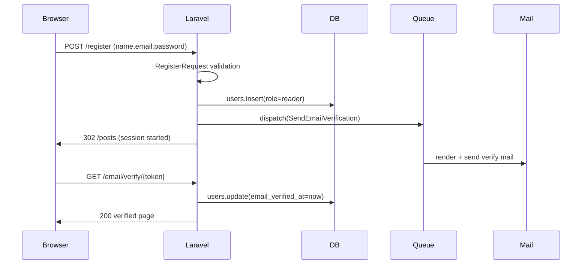
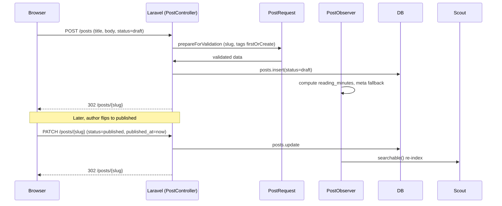
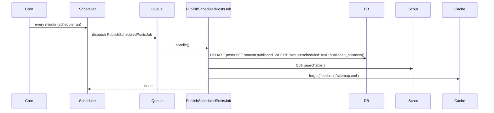
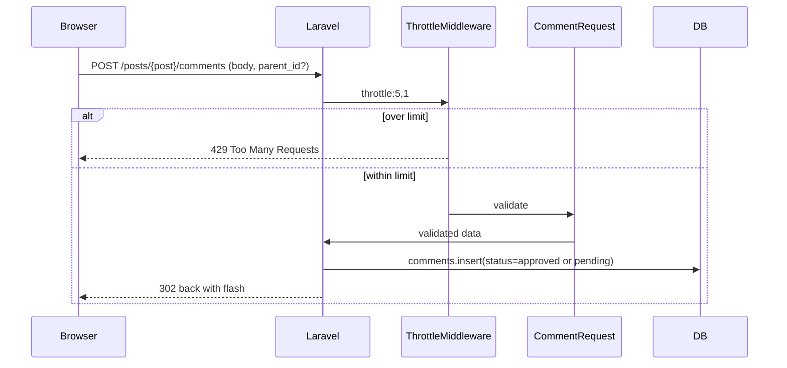
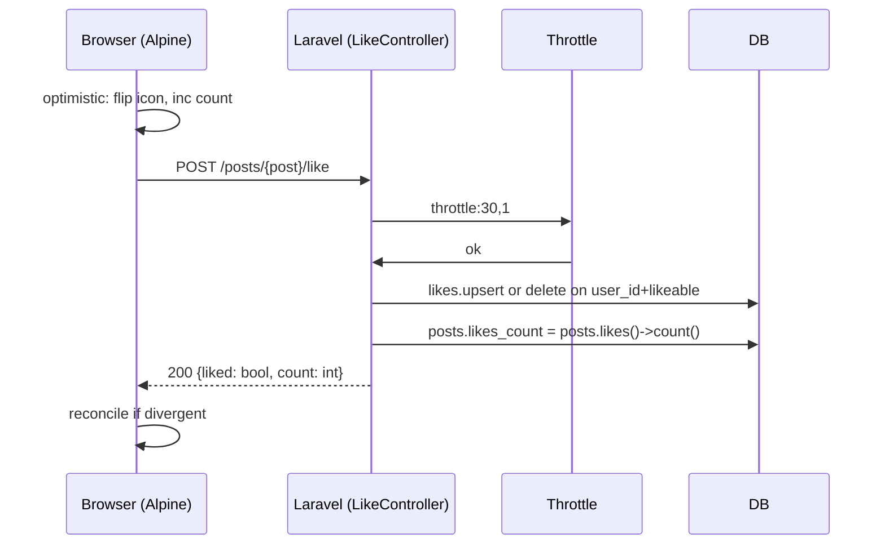
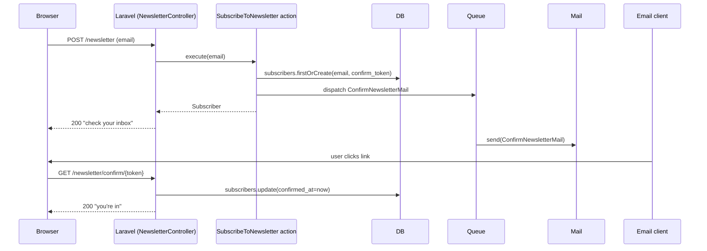
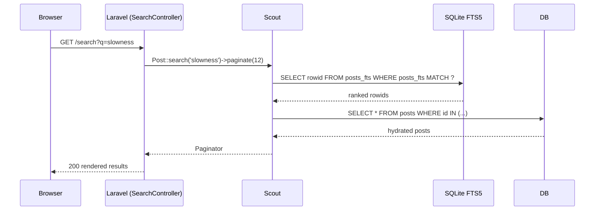
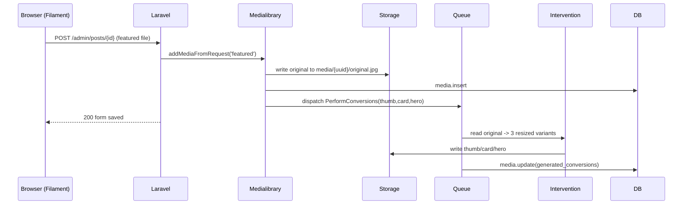

# 04 — Sequence Diagrams

This document shows the eight most important request flows of the Cozy Lagoon blog as Mermaid `sequenceDiagram` blocks. Each flow is annotated with the requirements it satisfies and the files that implement it.

Actors used across diagrams: `Browser`, `Nginx`, `Laravel` (HTTP kernel + controller), `Queue`, `DB`, `Mail`, `Storage`, `Cache`, `Scout`.

---

## 4.1 Registration with email verification

Satisfies FR-001, FR-004.

---

## 4.2 Draft creation → publish transition

Satisfies FR-007, FR-008, FR-009, FR-011, FR-013.

---

## 4.3 Scheduled publish (cron-driven)

Satisfies FR-009, FR-023, FR-024.

---

## 4.4 Comment submission with rate limit + moderation

Satisfies FR-016, FR-020, FR-031, NFR-004.

---

## 4.5 Like toggle (optimistic UI, idempotent)

Satisfies FR-017, NFR-004.

---

## 4.6 Newsletter double opt-in

Satisfies FR-026, FR-027, FR-028.

---

## 4.7 Search query

Satisfies FR-022.

---

## 4.8 Image upload with variant generation

Satisfies FR-012.

---

**Last updated:** 2026-04-20
