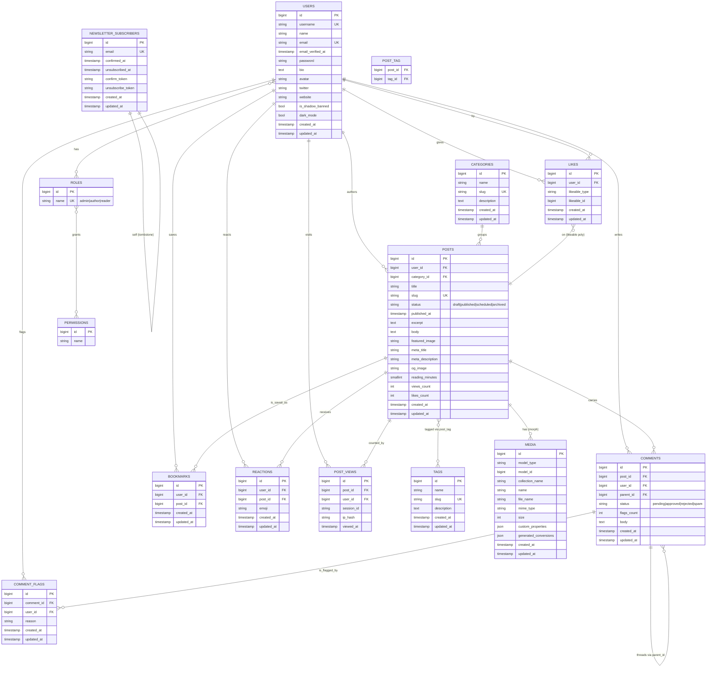

# 05 — Entity Relationship Diagram

This document shows every persistent entity in the Cozy Lagoon blog and how they relate. The ERD is authoritative: if the code diverges from what is drawn here, one of them is a bug.

## Diagram

## Entity notes

### `users`

| Column | Notes |
|---|---|
| `username` | Unique, slug-safe, routes to `/authors/{username}`. |
| `email_verified_at` | Populated on verification click. Unverified users may read but not comment. |
| `is_shadow_banned` | When `true`, this user's comments render only to themselves. |
| `dark_mode` | Server-persisted preference for authed users; guests use `localStorage`. |

### `posts`

| Column | Notes |
|---|---|
| `status` | String enum; indexed for fast filtering on `/` and `/admin`. |
| `published_at` | Indexed; ordering key for the homepage. Future values indicate `scheduled`. |
| `reading_minutes` | Set by `PostObserver` on save; `ceil(word_count / 200)`. |
| `views_count`, `likes_count` | Denormalized counters for cheap renders; canonical values recomputable from tables. |
| `og_image` | Falls back to `featured_image`, then a site default paper-and-teal card. |

### `comments`

Threaded via `parent_id`. Cascades on post or user delete. `status` distinct from moderation `flags_count` — a comment can be `approved` and still flagged.

### `likes`

Polymorphic via `likeable_type` + `likeable_id` to reuse the same table for likes on posts *and* comments. Unique index on `(user_id, likeable_type, likeable_id)` makes the toggle idempotent.

### `bookmarks`

Deliberately **non-polymorphic** — only posts are bookmarkable and keeping the table simple avoids mixing semantics.

### `reactions`

Unique on `(user_id, post_id, emoji)`. Whitelisted emoji set enforced at the controller layer, not the DB — easier to tune.

### `post_views`

Deduplicated via unique index on `(post_id, session_id, DATE(viewed_at))`. `ip_hash` is a salted SHA-256 so we can count unique-ish views without storing PII.

### `newsletter_subscribers`

Self-relationship is not structural — `unsubscribed_at` tombstones a record so re-subscribing starts a fresh double opt-in cycle rather than silently re-enrolling.

### `media`

Managed by `spatie/laravel-medialibrary`. `generated_conversions` is a JSON map `{thumb: true, card: true, hero: true}` once the queue job finishes variant generation.

### `roles` / `permissions`

From `spatie/laravel-permission`. We only use roles for gating; permissions tables ship but we do not (yet) use them per-capability.

---

**Last updated:** 2026-04-20
