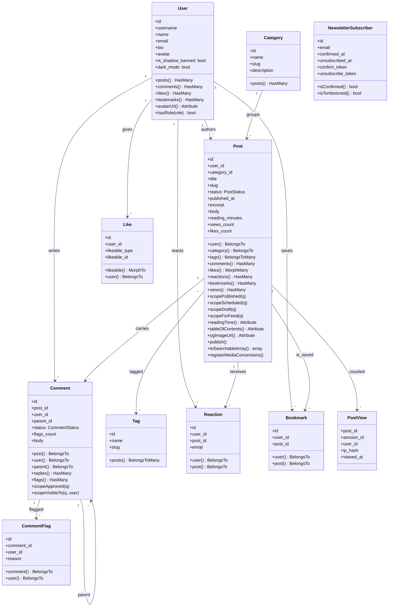
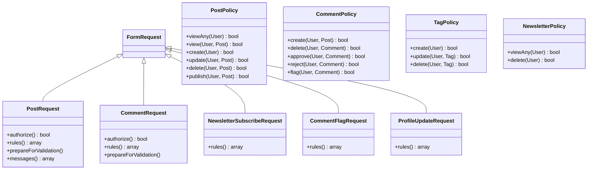
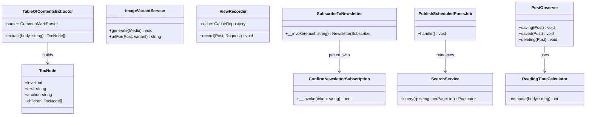

# 06 — Class Diagram

This document shows the application's PHP classes grouped into three subsystems. A single monolithic class diagram would be unreadable, so we split by concern: Domain, Policies + Requests, Services + Actions.

---

## 6.1 Domain models

Eloquent models and their relationships. Every model extends `Illuminate\Database\Eloquent\Model`.

---

## 6.2 Policies and Form Requests

Authorization and validation. Each `*Policy` extends nothing (Laravel discovers via convention); each `*Request` extends `Illuminate\Foundation\Http\FormRequest`.

---

## 6.3 Services and Actions

Domain logic that does not belong on a model. Services are long-lived singletons; actions are invocable classes for a single use case.

### Method notes

| Method | Contract |
|---|---|
| `ReadingTimeCalculator::compute($body)` | Strip HTML → split on whitespace → `ceil(count / 200)`. Returns at least `1`. |
| `TableOfContentsExtractor::extract($body)` | Walks CommonMark AST, emits only `H2`/`H3`, auto-generates slug anchors, nests H3 under H2. |
| `ImageVariantService::generate(Media $m)` | Dispatches three queued conversions; no-op if already generated. |
| `ViewRecorder::record(Post, Request)` | Cache key `view:{post_id}:{session_id}:{yyyymmdd}` with TTL 24h; increments only on first hit. |
| `SubscribeToNewsletter($email)` | Idempotent: re-entering a confirmed email returns the existing subscriber; re-entering a tombstoned email creates a fresh pending record. |
| `PublishScheduledPostsJob::handle()` | Single SQL UPDATE + bulk `searchable()` + cache-forget of feed/sitemap. Idempotent, safe to run every minute. |
| `PostObserver::saving($post)` | Sets `reading_minutes`, auto-sets `published_at` on draft→published transitions, fills missing `meta_description` from excerpt. |

---

**Last updated:** 2026-04-20
