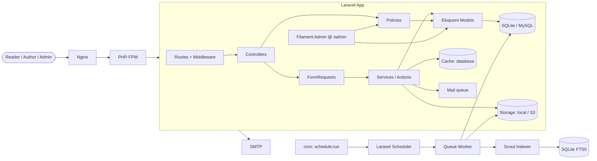
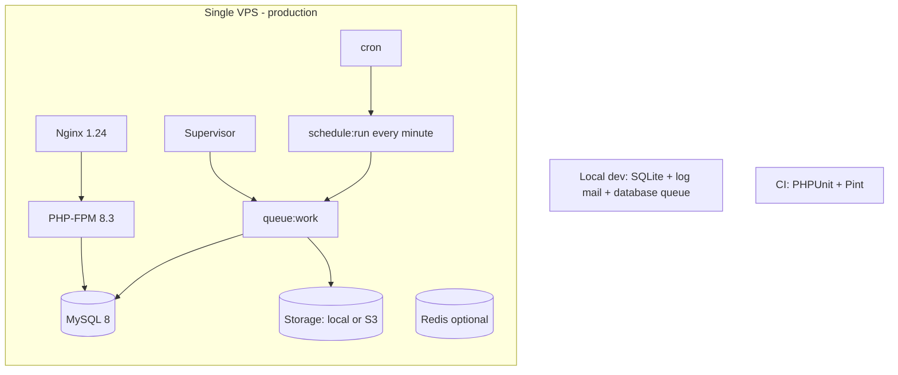

# 07 — Architecture

This document records the architecture style we chose for the Cozy Lagoon blog, why we chose it, and how the pieces fit together at runtime and at rest. It is the "why" behind the code structure.

## Chosen style — Layered Modular Monolith (MVC + Services/Actions)

The application is a **layered, modular monolith** built on Laravel's MVC foundations with an explicit **Services / Actions** layer for domain logic that does not belong on a model. All layers ship as a single deployable, but the code is organized so each feature slice (posts, comments, likes, newsletter, admin) is understandable in isolation.

## Why this style

| Factor | Influence |
|---|---|
| **Team size** | One or two developers. Network boundaries between services would be pure overhead. |
| **Scale** | Target 50 k monthly visits, single VPS. A monolith comfortably handles this with room. |
| **Laravel alignment** | MVC + queues + scheduler are Laravel's sweet spot. Working with the framework, not around it, is the cheapest code to maintain. |
| **Filament fits in** | Filament v4 ships as a Laravel module. Putting it in its own service would mean duplicating models and migrations. |
| **Evolution** | Extracting a service later (e.g. a separate search microservice if we outgrow SQLite FTS) is easier from a well-layered monolith than from a tangled one. |

## Alternatives considered (and rejected)

- **Microservices.** Operational cost, distributed transactions, deployment choreography — none of which pay off at this scale. Rejected.
- **Hexagonal / Ports & Adapters.** Value when swapping infrastructure is a frequent event. For a blog we change the DB maybe once in its lifetime. The ceremony (port interfaces, adapters, inverted dependencies) would outweigh the benefit. Rejected.
- **Event sourcing / CQRS.** We do not have an auditability driver or high read/write skew. A request like "show the current version of post X" is native to Eloquent; event-sourcing it would slow development without a corresponding payoff. Rejected.
- **Serverless / Jamstack + headless CMS.** Would fight the premise of a writer-centric, cozy authoring experience. Also a poor fit for comment moderation, scheduled publishing, and queue work. Rejected.

## Component diagram



## Layering rules

Call graph goes strictly downward. Violations are treated as bugs.

```
Routes / Middleware
    ↓
Controllers / Filament Resources
    ↓
FormRequests (validation)     Policies (authorization)
    ↓
Services / Actions
    ↓
Eloquent Models  ─────►  Database
```

- Controllers may call Services, Policies, and (through `->validated()`) FormRequests. They never write raw SQL and never call other controllers.
- Services may call Models, other Services, Cache, Storage, Mail.
- Models never call Services — a model that needs behavior pulls it in via trait or pushes the work up to a Service.
- Policies only read Models. They never mutate.

## Deployment view



Production single-node layout:
- **Nginx** terminates TLS, serves static assets, proxies PHP to FPM.
- **PHP-FPM** runs the Laravel app.
- **Supervisor** keeps `php artisan queue:work` alive.
- **Cron** runs `php artisan schedule:run` every minute.
- **MySQL 8** for production; **SQLite** is fine for local dev (the existing `CLAUDE.md` contract).
- **Storage** is the local `public` disk by default; swap to S3 via `FILESYSTEM_DISK=s3`.

## Cross-cutting concerns

| Concern | Mechanism |
|---|---|
| **Authentication** | Custom LoginController + RegisterController; sessions in DB. No Sanctum needed (no API clients beyond RSS). |
| **Authorization** | Policies autoloaded by Laravel; `spatie/laravel-permission` for roles. |
| **Validation** | FormRequests; `prepareForValidation` normalizes data before rules run (existing pattern). |
| **Rate limiting** | `throttle:X,M` middleware on mutating public routes. |
| **Logging** | `stack` channel: `single` file + `stderr` in production; Telescope in local only. |
| **Caching** | Database cache driver (per existing `.env.example`). Short-lived caches on `/feed.xml` and `/sitemap.xml`. |
| **Queueing** | Database queue. Jobs: `PublishScheduledPostsJob`, mail sends, image variant generation, Scout reindex. |
| **Error handling** | Laravel's default exception handler; 404/403/500 Blade views styled to Cozy Lagoon. |

## Trade-offs

- **SQLite FTS5 for search** — zero infra cost, zero setup. Trade: no typo tolerance, no faceting. Swap to Meilisearch by changing `SCOUT_DRIVER` when we outgrow it.
- **Database queue** — one less moving part than Redis. Trade: polling cost. At this traffic, negligible.
- **Denormalized counters** (`views_count`, `likes_count`) — cheap reads. Trade: can drift; we recompute in a nightly job if needed.
- **Markdown bodies** — friendly to authors, renderable everywhere. Trade: no rich-text WYSIWYG. Filament's Markdown editor + preview covers the gap.
- **Polymorphic likes, non-poly bookmarks** — pragmatism over purity. Likes must work on comments too; bookmarks only on posts, so we keep that table simple.

## Future evolution path

1. **If search demands fuzziness** → add Meilisearch, change `SCOUT_DRIVER=meilisearch`, keep same model traits.
2. **If traffic exceeds ~500 k monthly visits** → add a read replica, move cache/queue to Redis, put a CDN in front of image variants.
3. **If multi-author volume grows** → lift moderation into its own service with an async interface; start by extracting `CommentPolicy` and the moderation queue into a package.
4. **If we need an external client** → add Laravel Sanctum + a versioned API (`routes/api.php`). The Service layer already acts as the "use case" boundary we would expose.
5. **If the design system spreads to other apps** → extract `resources/css/app.css` + Blade components into a `cozy-lagoon` Composer package.

Every one of these is a reachable next step *because* the monolith is layered. That is the payoff.

---

**Last updated:** 2026-04-20
