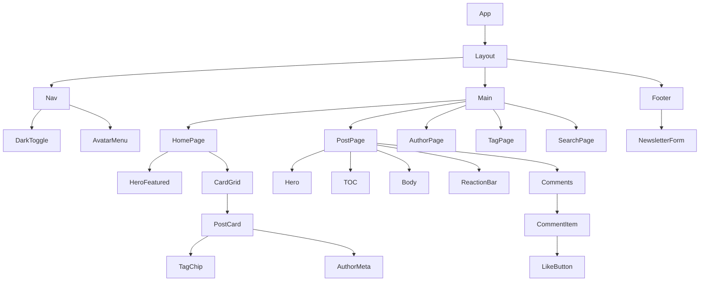

# 08 — Design System — Cozy Lagoon

This document specifies the visual and interaction language of the Cozy Lagoon blog. Every color, font, spacing step, and component listed here exists to make one thing easy: reading for a long time without fatigue.

## Brand vibe

Cozy Lagoon is warm paper and still water. The site should feel like a thick, cream-coloured notebook held open at a quiet table, with a teal pond in view through the window. It is not minimal-for-the-sake-of-minimal; it is minimal so your eyes can rest on the text. Accents are used like punctuation, not decoration. Motion is slow and deliberate. Dark mode is evening, not neon — the teal dims, the paper turns to slate, and the typography stays exactly where it was.

## Color tokens

All values shown with their `light` value first and `dark` counterpart second. Every pair meets or exceeds WCAG 2.1 AA on body text (≥ 4.5:1) or large text (≥ 3:1).

| Token | Light | Dark | Use |
|---|---|---|---|
| `--paper` | `#FBF7EF` | `#141818` | Page background |
| `--paper-raised` | `#FFFDF8` | `#1B2020` | Cards, modals |
| `--ink` | `#1B1B1B` | `#EDE6D6` | Body text |
| `--muted-ink` | `#4A4A48` | `#A8A29B` | Meta, captions |
| `--lagoon` | `#0E6E6E` | `#6FBEB5` | Primary accent, links |
| `--lagoon-deep` | `#0A5454` | `#4FA8A0` | Hover, active states |
| `--lagoon-pale` | `#DCEFEC` | `#1E3A38` | Surface accents, chips |
| `--ember` | `#B8603B` | `#E08862` | Warning / danger / alerts |
| `--moss` | `#6B8F5E` | `#8FB480` | Success |
| `--cream` | `#F3EADB` | `#26221C` | Subtle section tint |
| `--hairline` | `#E8DFCB` | `#2B2A27` | 1 px borders |

### Contrast reference (on `--paper`)

| Token | Ratio | Grade |
|---|---|---|
| `--ink #1B1B1B` | 15.6:1 | AAA |
| `--muted-ink #4A4A48` | 8.1:1 | AAA |
| `--lagoon #0E6E6E` | 5.2:1 | AA |
| `--ember #B8603B` | 4.8:1 | AA |

### CSS token definition

```css
@theme {
  --color-paper: #FBF7EF;
  --color-paper-raised: #FFFDF8;
  --color-ink: #1B1B1B;
  --color-muted-ink: #4A4A48;
  --color-lagoon: #0E6E6E;
  --color-lagoon-deep: #0A5454;
  --color-lagoon-pale: #DCEFEC;
  --color-ember: #B8603B;
  --color-moss: #6B8F5E;
  --color-cream: #F3EADB;
  --color-hairline: #E8DFCB;
}

[data-theme="dark"] {
  --color-paper: #141818;
  --color-paper-raised: #1B2020;
  --color-ink: #EDE6D6;
  --color-muted-ink: #A8A29B;
  --color-lagoon: #6FBEB5;
  --color-lagoon-deep: #4FA8A0;
  --color-lagoon-pale: #1E3A38;
  --color-ember: #E08862;
  --color-moss: #8FB480;
  --color-cream: #26221C;
  --color-hairline: #2B2A27;
}
```

## Typography

Two families, both served via Bunny Fonts (privacy-respecting, no tracking).

| Family | Role | Weights |
|---|---|---|
| **Source Serif 4** | Display, h1–h4, post body | 400, 600, 700 |
| **Space Grotesk** | UI, buttons, nav, meta | 400, 500, 600 |
| **Inter** (fallback) | System fallback only | — |

### Scale

| Token | Size / Line | Usage |
|---|---|---|
| `display` | 48 / 56 | Homepage hero title |
| `h1` | 36 / 44 | Post title |
| `h2` | 28 / 36 | Section heading |
| `h3` | 22 / 30 | Subsection heading |
| `body` | 17 / 28 | Reading body |
| `ui` | 15 / 22 | Buttons, form labels |
| `meta` | 14 / 20 | Card meta, captions |
| `caption` | 13 / 18 | Footnotes, timestamps |

Body text is **17 / 28** — intentionally larger than the usual `16 / 24`. Reading is the product.

## Spacing — 4 pt grid

```
2  4  8  12  16  20  24  32  48  64  96
```

Corresponding Tailwind: `0.5 / 1 / 2 / 3 / 4 / 5 / 6 / 8 / 12 / 16 / 24`.

## Radius

| Token | Value | Usage |
|---|---|---|
| `radius-sm` | 6 px | Tags, chips, inline inputs |
| `radius-md` | 10 px | Buttons, cards |
| `radius-lg` | 16 px | Hero cards, modals |
| `radius-pill` | 9999 px | Reaction buttons, avatars |

## Shadows

| Token | Value | Usage |
|---|---|---|
| `shadow-paper` | `0 1px 2px rgba(27,27,27,.06)` | Default card lift |
| `shadow-lift` | `0 8px 24px rgba(14,110,110,.12)` | Hover, modals |
| `shadow-ring` | `0 0 0 2px var(--color-lagoon), 0 0 0 4px var(--color-paper)` | Focus state |

## Motion

| Token | Duration | Easing | Usage |
|---|---|---|---|
| `motion-fast` | 120 ms | `cubic-bezier(.2,.8,.2,1)` | Small state flips (like toggle) |
| `motion-base` | 200 ms | `cubic-bezier(.2,.8,.2,1)` | Hover, nav reveal |
| `motion-slow` | 320 ms | `cubic-bezier(.2,.8,.2,1)` | Modals, page transitions |

All motion is conditioned on `prefers-reduced-motion`:

```css
@media (prefers-reduced-motion: reduce) {
  *, ::before, ::after { animation-duration: 0ms !important; transition-duration: 0ms !important; }
}
```

## Components

Each component below lists its role, states, and a canonical snippet.

### Button

- **Variants:** `primary` (lagoon fill), `ghost` (transparent + lagoon text), `danger` (ember fill).
- **States:** idle, hover (`lagoon-deep`), active (pressed 1 px down), disabled (50 % opacity), focus (`shadow-ring`).
- **Height:** 40 px; padding `0 16 px`; radius `md`; typography `ui` 500.

```html
<button class="inline-flex items-center gap-2 rounded-md bg-lagoon px-4 py-2 font-medium text-paper
               hover:bg-lagoon-deep focus-visible:outline-none focus-visible:ring-2 focus-visible:ring-lagoon">
  Publish
</button>
```

### Input / Textarea

- Background `paper-raised`, border `1 px hairline`, radius `md`, padding `10 px 12 px`.
- Focus: border becomes `lagoon`, outer `shadow-ring`.
- Textarea includes an inline Markdown toolbar (bold, italic, link, H2, list) via Alpine.

### Card (post-card)

- Background `paper-raised`, radius `lg`, shadow `paper`, 24 px padding.
- Hover: translate Y −2 px, shadow `lift`.
- Contains: featured image (16:10 card variant), tag chip row, h3 title, excerpt (3 lines, `-webkit-line-clamp`), author + reading time meta.

### Tag chip

- Background `lagoon-pale`, text `lagoon-deep`, height 24 px, radius `pill`, padding `0 10 px`, font `meta` 500.
- Hover: background darkens by one step.

### Badge

- Status markers on admin: `draft` (muted-ink outline), `scheduled` (ember outline), `published` (moss outline), `archived` (hairline outline).

### Nav bar

- Height 64 px, sticky, translucent paper with `backdrop-filter: blur(8px)`.
- Wordmark left ("the lagoon" in Source Serif 700), center nav (Home / Tags / Search), right actions (Dark toggle / Login / Avatar menu).

### Footer

- Two-column: left = wordmark + one-line mission, right = newsletter form.
- Thin `hairline` top border, `muted-ink` copy.

### Comment item

- Indented by thread depth (max 3). Avatar + author name + timestamp + body + reply button.
- Pending comments show a `muted-ink` "Awaiting review" pill to the author only.

### Toast

- Top-right, `paper-raised` background, `moss`/`ember` left border (4 px), auto-dismiss 4 s.

### Modal

- Overlay `rgba(20,24,24,.48)`, content `paper-raised`, radius `lg`, max-width 520 px, `shadow-lift`.

### Like button

- Heart outline idle → filled `ember` on active. Number beside it in `meta`. Tap: `motion-fast` scale 1 → 1.15 → 1.

### Bookmark button

- Ribbon icon; filled `lagoon` on active. Identical interaction pattern to like.

### TOC

- Sticky on viewports ≥ 1024 px. List of `H2` + nested `H3`. Active heading underlined with 2 px `lagoon`. Scroll-spy via IntersectionObserver.

### Reaction bar

- Inline row of whitelisted emoji (👍 ❤️ 😂 😮 😢 🙌). Each is a pill button; counts update optimistically. Tippy.js tooltip shows top reactors.

### Newsletter form

- Single field + submit. Inline success/error toast. Explicit opt-in helper text below: "A letter, twice a month. No algorithm."

### Pagination

- `Previous / 1 / 2 / 3 / … / Next`. Current page filled `lagoon`; others ghost. 40 × 40 px tap targets.

### Admin preview card

- Filament uses our Cozy theme variables; preview cards in the dashboard mirror the public post-card so admins see what readers will see.

## Layout patterns

| Pattern | Spec |
|---|---|
| **Reading column** | `max-width: 68ch` centered, `padding: 0 16 px`. Post body and prose. |
| **Sidebar grid** | `[1fr 280px]` on ≥ 1024 px; stacks below. Used on post detail (body + TOC). |
| **Hero** | 64 px top padding, display title, single-line subtitle in `muted-ink`, optional `ember` underline on the hero accent word. |
| **Grid of cards** | `repeat(auto-fill, minmax(280px, 1fr))`, gap 24 px. Used on home, tag, author pages. |

## Iconography

- Icon family: **Lucide** (16 / 20 / 24 sizes).
- Stroke width: 1.75 px; rounded caps and joins.
- Color: inherits `currentColor`; reserve `lagoon` for active/primary actions.

## Accessibility

- Minimum contrast: 4.5:1 body, 3:1 large text.
- Every interactive element has a visible focus state: `shadow-ring` token, not removed with `outline: none` alone.
- Skip-to-content link top-left, visible on focus.
- `prefers-reduced-motion` honored globally.
- Forms: labels are always rendered (never placeholder-only); error text has `aria-describedby` wiring.
- Dark mode: not just an inversion — colors are re-picked so warm paper becomes slate and teal dims gracefully.

## Component hierarchy



## ASCII mockups

### Homepage

```
┌──────────────────────────────────────────────────────────────┐
│  the lagoon          home  tags  search            ☾  login ▸│
│ ────────────────────────────────────────────────────────────── │
│                                                              │
│                     A slow blog about craft,                 │
│              rooms, and the things we keep nearby.           │
│                                                              │
│  ╭──────────────────────────────────╮                        │
│  │ Featured · 8 min read            │                        │
│  │ ─────────────────────────        │                        │
│  │    On writing slowly             │  ▏ Latest              │
│  │                                  │  ▏                     │
│  │ A meditation on why the best     │  ▏ Notes on teal   5m  │
│  │ essays take weeks, not hours.    │  ▏ A quiet kitchen 3m  │
│  │                                  │  ▏ Letters home   12m  │
│  │ #craft  #notes  · by Amira ·     │  ▏ On the dock     7m  │
│  │ Apr 20                           │  ▏ The second cup  4m  │
│  ╰──────────────────────────────────╯                        │
│                                                              │
│  ┌─ Notes ────────┐ ┌─ Craft ────────┐ ┌─ Life ─────────┐   │
│  │ card           │ │ card           │ │ card           │   │
│  └────────────────┘ └────────────────┘ └────────────────┘   │
│                                                              │
│  ─────────── « 1 · 2 · 3 » ───────────                       │
└──────────────────────────────────────────────────────────────┘
```

### Post detail

```
┌──────────────────────────────────────────────────────────────┐
│  the lagoon          home  tags  search            ☾  login ▸│
│ ────────────────────────────────────────────────────────────── │
│                                                              │
│   Craft · 8 min read · Apr 20                                │
│                                                              │
│   On Writing Slowly                                          │
│   ─────────────────                                          │
│   A meditation on why the best essays take weeks, not hours. │
│                                                              │
│   by Amira Khoury · #craft #notes                            │
│                                                              │
│  ┌────────────────────────────────────┐  ┌── On this page ──┐│
│  │  [ featured image — hero variant ] │  │ ▎ Beginnings     ││
│  └────────────────────────────────────┘  │   Slowness       ││
│                                           │ ▎ Kitchen light  ││
│   Beginnings                              │   A conclusion   ││
│   I did not start by writing…             └──────────────────┘│
│   (body in Source Serif 17/28)                               │
│                                                              │
│   ❤ 42    🔖 Save    👍❤😂😮😢🙌                             │
│                                                              │
│  ─── 7 comments ──────────────────────────────────────────── │
│  ○ Omar  2h ago                                              │
│     Reading this on a Sunday felt right.          ↩ Reply    │
└──────────────────────────────────────────────────────────────┘
```

### Author profile

```
┌──────────────────────────────────────────────────────────────┐
│  the lagoon          home  tags  search            ☾  login ▸│
│                                                              │
│   ◉  AMIRA KHOURY                                            │
│       @amira · Cairo · twitter · web                         │
│                                                              │
│       Writes about craft, kitchens, and quiet rooms.         │
│       Twelve posts · Joined Jan 2026                         │
│                                                              │
│   ─── Posts ───────────────────────────────────────────────  │
│                                                              │
│   ▪ On Writing Slowly            Craft · 8 min · Apr 20      │
│   ▪ Notes on Teal                Design · 5 min · Apr 18     │
│   ▪ A Quiet Kitchen              Life · 3 min · Apr 15       │
│   ▪ Letters from the Dock        Craft · 12 min · Apr 10     │
│                                                              │
└──────────────────────────────────────────────────────────────┘
```

### Filament admin dashboard (Cozy theme)

```
┌──────────────────────────────────────────────────────────────┐
│ ⚙  the lagoon · admin         Amira ▾                        │
├─ Sidebar ──┬──────────────────────────────────────────────── │
│ ⌂ Dash     │  Overview                                       │
│ ✎ Posts    │  ┌──── Posts ────┐ ┌── Subscribers ──┐          │
│ # Tags     │  │ 38 published  │ │  1,204 active   │          │
│ ▢ Comments │  │  4 drafts     │ │     12 pending  │          │
│ ♺ Categories│ │  2 scheduled  │ └──────────────────┘         │
│ ✉ Newsletter│ └───────────────┘                              │
│ ⚑ Users    │                                                 │
│             │  Top posts (7 days)    Needs moderation (3)    │
│             │  ▌▌▌▌▌▌▌▌             ○ flag on "Teal notes"    │
│             │                        ○ flag on "Sunday"       │
│             │                        ○ pending on "Kitchen"   │
└─────────────┴─────────────────────────────────────────────── │
```

## Implementation anchor points

| Concern | File |
|---|---|
| CSS tokens | [resources/css/app.css](../resources/css/app.css) — under `@theme` |
| Layout wrapper | [resources/views/layouts/blog.blade.php](../resources/views/layouts/blog.blade.php) |
| Public components | `resources/views/components/blog/` (to be created) |
| Admin theme | `resources/css/filament/admin/theme.css` (to be created) |
| Dark-mode toggle | `resources/js/modules/theme-toggle.js` (to be created) |

---

**Last updated:** 2026-04-20
